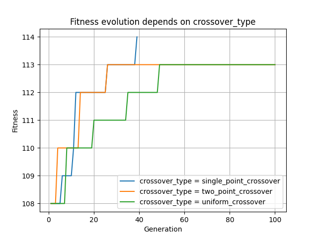
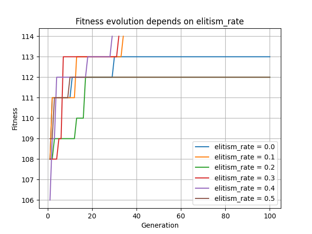
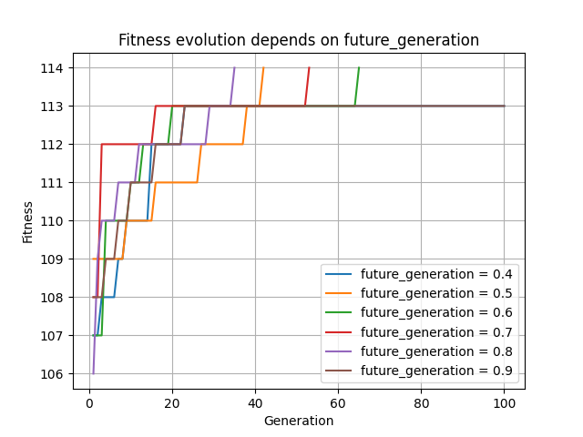
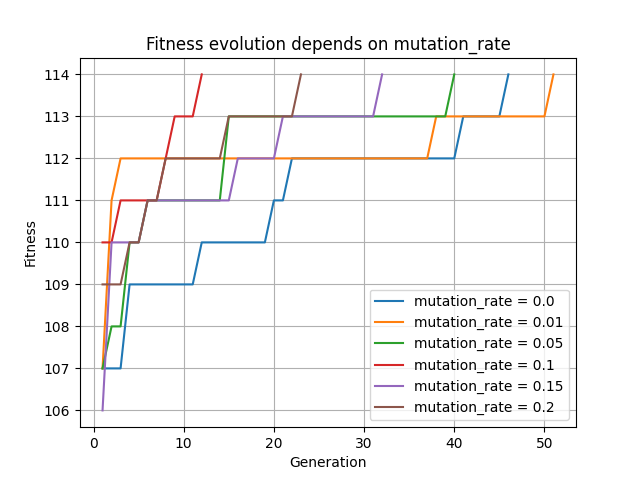
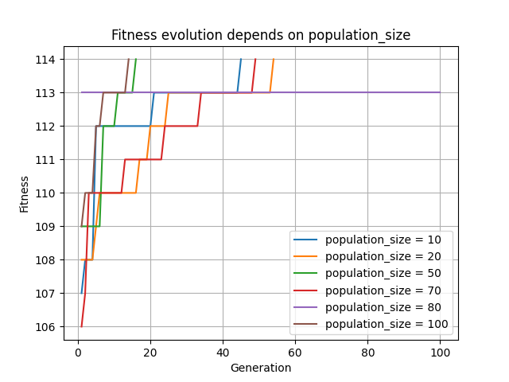
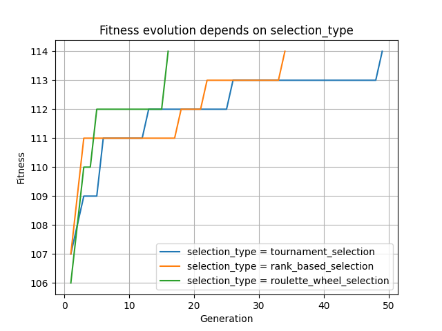

# Dzen Garden

## About

This project contains a genetic algorithm implemented to solve the Zen Garden problem. The goal is to simulate a monk raking a garden filled with sand and immovable rocks, creating patterns by covering the garden under specific movement rules. The algorithm aims to find an optimal sequence of moves that allows the monk to rake the maximum possible area of the garden.

## Task

A Zen garden is an area filled with coarser sand. However, it also contains non-movable larger objects such as rocks. The monk has to adjust the sand in the garden with a rake so that strips are formed as in the following picture.


The strips can only go horizontally or vertically, never diagonally. He always starts at the edge of the garden and pulls a straight strip to the other edge or to an obstacle. At the edge - outside the garden he can walk as he wishes. But if he comes to an obstacle - a rock or already raked sand - he must turn around if he has somewhere to go. If he has free directions to the left and right, he may choose where to turn. If he has only one direction free, he turns there. If he has nowhere to turn, it's game over. A successful game is one in which the monk can rake the whole garden, given the rules, for the maximum possible number of squares. The output is the coverage of a given garden by the monk's passes. For example, the coverage corresponding exactly to the first picture is as follows:

| 0    | 0    | 1    | 0    | 0    | 0    | 0    | 0    | 10   | 10    | 8     | 9     |
| ---- | ---- | ---- | ---- | ---- | ---- | ---- | ---- | ---- | ----- | ----- | ----- |
| 0    | 0    | 1    | 0    | 0    | K    | 0    | 0    | 10   | 10    | 8     | 9     |
| 0    | K    | 1    | 0    | 0    | 0    | 0    | 0    | 10   | 10    | 8     | 9     |
| 0    | 0    | 1    | 1    | K    | 0    | 0    | 0    | 10   | 10    | 8     | 9     |
| 0    | 0    | K    | 1    | 0    | 0    | 0    | 0    | 10   | 10    | 8     | 9     |
| 2    | 2    | 2    | 1    | 0    | 0    | 0    | 0    | 10   | 10    | 8     | 9     |
| 3    | 3    | 2    | 1    | 0    | 0    | 0    | 0    | K    | K     | 8     | 8     |
| 4    | 3    | 2    | 1    | 0    | 0    | 0    | 0    | 5    | 5     | 5     | 5     |
| 4    | 3    | 2    | 1    | 0    | 0    | 0    | 11   | 5    | 6     | 6     | 6     |
| 4    | 3    | 2    | 1    | 0    | 0    | 0    | 11   | 5    | 6     | 7     | 7     |

## Algorithm

The implemented algorithm is a classical **Genetic Algorithm (GA)** designed to evolve a population of potential solutions over several generations. 

The core body of this program is located in the file `'algorithm.py'` and contains the logic of the whole genetic algorithm, to which functions from other modules are connected to produce a consistent work. 
### Main Loop

1. **Initialization**: Generate an initial population of individuals with randomly assigned genes.
``` python
population = generate_population(population_size)  
population_number = 1
```

2. **Fitness Evaluation**: Calculate the fitness of each individual by simulating the monk's movements and determining the number of garden cells raked.
``` python
evaluated_population = evaluation(population)
```

3. **Elitism**: Preserve a fraction of the best individuals to ensure the best solutions are carried over to the next generation.
``` python
next_population = elitism(evaluated_population)
```

4. **Selection**: Select individuals from the current population based on their fitness to participate in reproduction.
``` python
if selection_type == "tournament_selection":  
    selected_population = tournament_selection(evaluated_population, int(population_size * future_generation))  
elif selection_type == "rank_based_selection":  
    selected_population = rank_based_selection(evaluated_population, int(population_size * future_generation))  
elif selection_type == "roulette_wheel_selection":  
    selected_population = roulette_wheel_selection(evaluated_population, int(population_size * future_generation))  
else:  
    selected_population = tournament_selection(evaluated_population, int(population_size * future_generation))
```

5. **Crossover**: Combine pairs of selected individuals to produce children for the next generation.
``` python
if crossover_type == "single_point_crossover":  
    crossed_population = single_point_crossover(selected_population)  
elif crossover_type == "two_point_crossover":  
    crossed_population = two_point_crossover(selected_population)  
elif crossover_type == "uniform_crossover":  
    crossed_population = uniform_crossover(selected_population)  
else:  
    crossed_population = single_point_crossover(selected_population)
```

6. **Mutation**: Introduce random changes to the child's genes to maintain genetic diversity.
``` python
mutated_population = mutation(crossed_population)  
next_population += mutated_population
```

7. **Iteration**: Repeat the evaluation, selection, crossover, mutation, and elitism steps for a predefined number of generations or until an optimal solution is found.
``` python
population = next_population  
population_number += 1
```

### Termination Conditions:

- **Maximum Generations**: The algorithm stops if it reaches the predefined number of generations.
``` python
if population_number == generations_size:
    break
```

- **Optimal Fitness**: The algorithm stops early if an individual achieves the maximum possible fitness (entire garden raked).
``` python
if best_fitness >= length * height - len(rocks):
    break
```


## Genes Generation

The entire logic for generating the genes of a single individual and generating an entire population is in the `'generation.py'` file.

### Genes Properties

Each individual in the population is represented by a set of genes divided into two parts:

1. **Positions Genes**: A list of starting positions on the perimeter of the garden where the monk begins raking.
	- **Positions**: A list of tuples representing coordinates `(y, x)` on the garden's perimeter, excluding corners and rocks.

2. **Turns Genes**: A list of decisions indicating the monk's turning direction when encountering an obstacle.
	- **Turns**: A list of characters (`'r'` or `'l'`) representing the monk's turning decisions (`'r'` for right, `'l'` for left) .

``` python
def generate_genes():  
    positions = []  
    turns = []  
  
    while len(positions) < length + height:  
        coordinates = generate_coordinates()  
        if coordinates not in positions:  
            positions.append(coordinates)  
  
    while len(turns) < len(rocks):  
        if random.choice([True, False]):  
            turns.append("r")  
        else:  
            turns.append("l")  
  
    return (positions, turns, 0) # One individual
```

The length of the positions list is set to the sum of the garden's length and height to ensure coverage possibilities, and the turns list length corresponds to the number of rocks, as obstacles influence turning decisions. 

The total number of genes has the length of half the perimeter of the garden plus the number of rocks (in our example `'12 + 10 + 6 = 28'`)

## Movement Logic

All logic for simulating the monk's movement through the garden and evaluating its results is in the `'fitness.py'` file.
### Movement Rules:

- The monk starts raking from a position on the garden's perimeter.
``` python
positions, turns, fitness = individual
for pos in positions:  
    current_pos = pos
```

- He moves in a straight line (either horizontally or vertically) until he reaches the garden's edge or encounters an obstacle (rock or already raked cell).
``` python
if direction == "r" and current_pos[1] + 1 < length and garden[current_pos[0]][current_pos[1] + 1] == 0:  
    current_pos = (current_pos[0], current_pos[1] + 1)  
    garden[current_pos[0]][current_pos[1]] = step  
    fitness += 1  
    moved = True
    
elif direction == "l" and current_pos[1] - 1 >= 0 and garden[current_pos[0]][current_pos[1] - 1] == 0:
	...
```

- If the monk has reached the perimeter of the garden while moving, it means that he has already passed from the edge and to the edge and he completes his movement and moves to the next starting position from the array of position genes.
``` python
if ((current_pos[1] == 0 and direction == "l") or  
        (current_pos[1] == length - 1 and direction == "r") or  
        (current_pos[0] == 0 and direction == "u") or  
        (current_pos[0] == height - 1 and direction == "d")):  
    step += 1  
    break
```

### Decision Logic:

- **Direction Assignment**: The initial direction is determined based on the starting position on the perimeter.
    - If starting on the top or bottom edge, the initial direction is vertical (`up` or `down`).
    - If starting on the left or right edge, the initial direction is horizontal (`left` or `right`).
```python
if current_pos[0] == 0:  
    direction = "d"  
elif current_pos[0] == height - 1:  
    direction = "u"  
elif current_pos[1] == 0:  
    direction = "r"  
elif current_pos[1] == length - 1:  
    direction = "l"
```

- **Turning Decisions**: When the monk needs to turn, he uses the next value from his turns genes.
    - **Left Turn**: Changes direction counter-clockwise.
    - **Right Turn**: Changes direction clockwise.
``` python
if turns[turn_index] == "l":  
    if direction == "r":  
        direction = "u"  
    elif direction == "u":  
        direction = "l"  
    elif direction == "l":  
        direction = "d"  
    elif direction == "d":  
        direction = "r"  
elif turns[turn_index] == "r":  
    if direction == "r":  
        direction = "d"  
    elif direction == "d":  
        direction = "l"  
    elif direction == "l":  
        direction = "u"  
    elif direction == "u":  
        direction = "r"

turn_count += 1  
turn_index += 1
```

- **Genes Array:** When The Monk reaches the end of the array of turn genes, he starts it over again to ensure that he will always have a decision on how to turn.
``` python
if turn_index >= len(turns):  
    turn_index = 0
```

- **Turn Counter**: The monk keeps track of consecutive turns to avoid infinite loops. After turning in all four directions (full rotation), he stops and moves to the next position from the array of position genes.
``` python
if turn_count == 4:  
    step += 1  
    break
```

## New Generation

The process of creating a new generation involves several key genetic algorithm operations: **Selection**, **Crossover**, **Mutation**, and **Elitism**. Each of these steps plays a crucial role in evolving the population towards better solutions.

### Selection

The selection process chooses individuals from the current population to participate in reproduction based on their fitness scores. This ensures that individuals with higher fitness have a higher chance of passing their genes to the next generation.

The selection methods implemented are located in the `'selection.py'` file. The algorithm supports three types of selection:

1. **Tournament Selection**: Randomly selects a subset of individuals (the tournament group) and chooses the best among them.
``` python
def tournament_selection(population, amount):  
    ...
```

2. **Rank-Based Selection**: Ranks the entire population based on fitness and selects the top-performing individuals.
``` python
def rank_based_selection(population, amount):
    ...
```

3. **Roulette Wheel Selection**: Assigns selection probability proportional to fitness, allowing individuals with higher fitness to have a higher chance of being selected.
``` python
def roulette_wheel_selection(population, amount):
	...
```

### Crossover

Crossover combines the genes of two parent individuals to produce children, promoting the exchange of genetic material and creating new solutions.

The crossover methods are implemented in the `'crossover.py'` file. The algorithm supports three types of crossover:

1. **Single-Point Crossover**: A random crossover point is selected, and the genes beyond that point are swapped between two parents.
``` python
def single_point_crossover(population):

	position_point = random.randint(0, len(parent1[0]) - 1) # Positions  
	turns_point = random.randint(0, len(parent1[1]) - 1) # Turns
	...
```
2. **Two-Point Crossover**: Two crossover points are selected, and the genes between these points are swapped.
``` python
def two_point_crossover(population):

	pos_point1, pos_point2 = sorted([random.randint(0, len(parent1[0]) - 1), random.randint(0, len(parent1[0]) - 1)]) # Positions  
	turns_point1, turns_point2 = sorted([random.randint(0, len(parent1[1]) - 1), random.randint(0, len(parent1[1]) - 1)]) # Turns
	...
```
3. **Uniform Crossover**: Each gene is independently swapped between parents with a certain probability.
``` python
def uniform_crossover(population):

	for j in range(len(parent1[0])):  # Positions
	    if random.choice([True, False]):  
	        child1_positions.append(parent1[0][j])  
	        child2_positions.append(parent2[0][j])  
	    else:  
	        child1_positions.append(parent2[0][j])  
	        child2_positions.append(parent1[0][j])
    ...
```
### Mutation

Mutation is a process in which genes of an individual may be changed with a randomly small chance, helping to maintain genetic diversity and prevent premature convergence.

The mutation process is defined in the `'mutation.py'` file and its logic is explained below:

**Mutation Process**:
- **Positions Genes**: A mutated position gene is replaced with a new random starting position.
``` python
if random.random() < mutation_rate:  
    pos = generate_coordinates()  
    new_individual[0][i] = pos
```

- **Turns Genes**: A mutated turn gene is changed to the new random generated turn.
``` python
if random.random() < mutation_rate:  
    if random.choice([True, False]):  
        new_individual[1][i] = "r"  
    else:  
        new_individual[1][i] = "l"
```

### Elitism

Elitism ensures that a fraction of the best-performing individuals is preserved unaltered for the next generation.

The process of elitism is defined in the file `'elitism.py'` and its logic is explained below:

**Elitism Process**:
-  **Sorting**: The population is sorted in descending order based on the fitness score.
``` python
for i in range(len(population_copy) - 1):  
    for j in range(i + 1, len(population_copy)):  
        if population_copy[i][2] < population_copy[j][2]:  
            population_copy[i], population_copy[j] = population_copy[j], population_copy[i]
```

- **Selection**: The top `elite_count` individuals are selected and guaranteed to pass into the next generation.
``` python
elite_population = []  
for i in range(elite_count):  
    elite_individual = (population_copy[i][0][:], population_copy[i][1][:], population_copy[i][2])  
    elite_population.append(elite_individual)  
  
return elite_population
```

## Settings

All adjustable parameters are centralized in the `'config.py'` file, allowing easy modification for experimentation and fine-tuning.

- **Population Size (`'population_size'`)**: Controls the number of individuals in the population.
- **Generations Size (`'generations_size'`)**: The maximum number of generations the algorithm will run.
- **Mutation Rate (`'mutation_rate'`)**: Probability of a gene undergoing mutation.
- **Elitism Rate (`'elitism_rate'`)**: Proportion of top individuals preserved in each generation.
- **Future Generation Proportion (`'future_generation'`)**: Fraction of the population that will be generated through selection and genetic operators.
- **Selection Type (`'selection_type'`)**: Choice among `'tournament_selection'`, `'rank_based_selection'`, or `'roulette_wheel_selection'`.
- **Crossover Type (`'crossover_type'`)**: Choice among `'single_point_crossover'`, `'two_point_crossover'`, or `'uniform_crossover'`.

The garden parameters have also been put into a configuration file so that they can be easily customized:

- **Garden Length (`'length'`)**: Sets the horizontal size of the garden grid.
- **Garden Height (`'height'`)**: Sets the vertical size of the garden grid.
- **Rocks Positions (`'rocks'`)**: A list of tuples representing the coordinates `(y, x)` of immovable rocks within the garden.

### Parameter Optimization

To enhance the performance of the genetic algorithm, I initially tried adjusting the parameters manually. However, this approach was time-consuming and inefficient. To automate the process and find the optimal configuration more effectively, I created the `'test.py'` file.

The `'test.py'` script systematically tests different combinations of parameters to identify the settings that yield the best fitness results for the algorithm.

#### Functionality
- **Parameter Generation**: The script generates various configurations by varying parameters such as population size, generation size, mutation rate, elitism rate, future generation proportion, selection type, and crossover type.
``` python
def generate_config():  
    configs = []  
    for population_size in [100, 200]:  
        for generations_size in [100, 200]:  
            for mutation_rate in [0.0, 0.01, 0.05]:  
                for elitism_rate in [0.0, 0.1, 0.2]:  
                    for future_generation in [0.6, 0.7, 0.8]:  
                        for selection_type in ["tournament_selection", "rank_based_selection", "roulette_wheel_selection"]:  
                            for crossover_type in ["single_point_crossover", "two_point_crossover", "uniform_crossover"]:  
                                config_dict = {  
                                    "population_size": population_size,  
                                    "generations_size": generations_size,  
                                    "mutation_rate": mutation_rate,  
                                    "elitism_rate": elitism_rate,  
                                    "future_generation": future_generation,  
                                    "selection_type": selection_type,  
                                    "crossover_type": crossover_type,  
                                }  
                                configs.append(config_dict)  
    return configs
```

- **Automated Testing**: It runs the genetic algorithm multiple times for each configuration and records the success rate of achieving the optimal fitness.
``` python
def test_config(conf, runs=100):
    update_config(conf)
    max_fitness = config.length * config.height - len(config.rocks)
    successful_runs = 0

    for i in range(runs):
        fitness = run(need_print=False)
        if fitness == max_fitness:
            successful_runs += 1

    success_rate = (successful_runs / runs) * 100
    return success_rate
```

#### Outcome
By using this automated testing approach, I was able to find the ideal configuration that significantly improved the algorithm's performance:

```
Best result: 
config = {
    'population_size': 200,
    'generations_size': 200,
    'mutation_rate': 0.0,
    'elitism_rate': 0.2,
    'future_generation': 0.7,
    'selection_type': 'tournament_selection',
    'crossover_type': 'single_point_crossover'
} 
success rate = 98.0%
```

This configuration achieved a `98.0%` success rate in obtaining the best possible fitness, which was a substantial improvement over manual parameter tuning.

### Analysis

For the purpose of analyzing parameters, I created a `'graph.py'` class that allows to test the effect of different parameters on fitness evolution and generate graphs for visual comparison. 
This class collects data and generates graphs for each parameter, which helps to determine how each parameter affects the performance of the genetic algorithm.

#### Parameter Setup

```python
parameter_name = 'crossover_type'
parameter_values = ["single_point_crossover", "two_point_crossover", "uniform_crossover"]
```
Here, we specify the parameter we want to test (for example `'crossover_type'`) and the values it can take.

#### Collecting Data

```python
def test(parameter_name, parameter_values):
    all_fitnesses = []
    for value in parameter_values:
        new_config = {parameter_name: value}
        update_config(new_config)
        fitnesses = run(need_print=False)
        all_fitnesses.append((value, fitnesses))
    return all_fitnesses
```
The `'test'` function runs the genetic algorithm for each parameter value, collects the fitness over generations, and stores the results.

#### Key Findings
**Type of crossover:**
Single-point crossover showed the fastest convergence in the early stages and eventually achieves better results compared to the others.



*Conclusion:* This type of crossover is best for rapid improvement.

**Level of elitism:**
High values (0.3-0.4) ensure better retention of the best individuals, resulting in faster fitness improvements.




*Conclusion:* High elitism level is preferred for stable results.

**Proportion of new generation:**
Values of 0.6-0.8 favor a better balance between retaining the best individuals and introducing new ones, which speeds up the learning process.




*Conclusion:* High values of `'future_generation'` parameter give better results.

**Mutation rate:**
Value 0.1 shows optimal diversity without compromising stability.




*Conclusion:* Moderate mutation level is preferred to maintain genetic diversity.

**Population size:**
Large population sizes, such as 100 individuals, give more stable and higher results, providing sufficient genetic variation.




*Conclusion:* Large population sizes are better for optimal results.

**Type of selection:**
Roulette-wheel selection performed better, quickly leading the algorithm to high fitness values.




*Conclusion:* Roulette-wheel selection is the most efficient method.

This table will allow a visual comparison of the effect of each parameter on the efficiency of the algorithm:

| Parameter             | Variations of Parameters               | Best Result    | Worst Result |
|-----------------------|----------------------------------------|----------------|--------------|
| **сrossover_type**    | single-point, two-point, uniform       | single-point   | uniform      |
| **elitism_rate**      | 0.0, 0.1, 0.2, 0.3, 0.4, 0.5           | 0.4            | 0.5          |
| **future_generation** | 0.4, 0.5, 0.6, 0.7, 0.8, 0.9           | 0.8            | 0.9          |
| **mutation_Rate**     | 0.0, 0.01, 0.05, 0.1, 0.15, 0.2        | 0.1            | 0.01         |
| **population_size**   | 10, 20, 50, 70, 80, 100                | 100            | 80           |
| **selection_type**    | tournament, rank-based, roulette-wheel | roulette-wheel | tournament   |


## Conclusion

The genetic algorithm developed for the Zen Garden problem successfully optimizes the monk’s raking patterns to cover the maximum possible area. Through systematic evaluation and parameter optimization, the algorithm demonstrates high effectiveness and efficiency. The use of automated testing and analysis allowed to identify optimal settings, which significantly improved the results and accelerated the convergence of the algorithm.

During the process, the performance of the code was improved through a thorough research of the parameters and their impact on the algorithm. This helped to improve the efficiency of the algorithm and better understand its dynamics.
